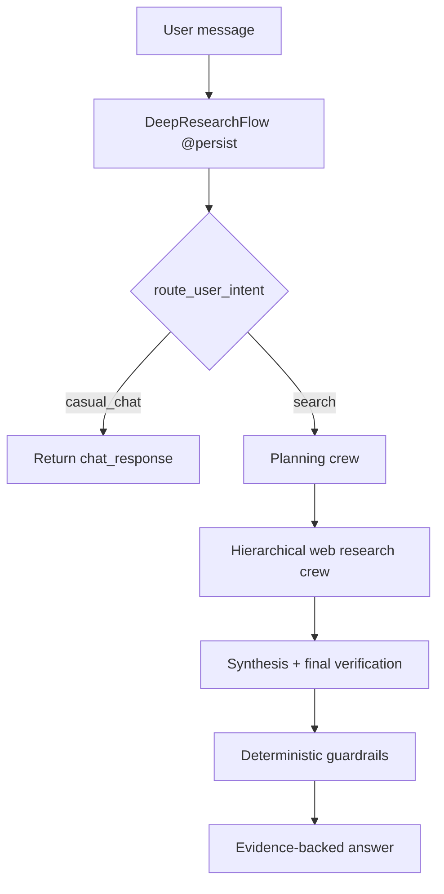

# PRD: Deep Research Agent Runtime

## 1. Ringkasan

Produk ini adalah runtime **deep research** berbasis `apps/agents` yang memakai CrewAI Flow sebagai router utama dan CrewAI hierarchical crew untuk cabang riset. Runtime berdiri sendiri dan belum terintegrasi ke `apps/api`, database aplikasi utama, SSE, atau UI web.

Fokus implementasi saat ini:

- `casual_chat` tetap ringan melalui Flow router.
- `search` menjalankan workflow riset terstruktur.
- Exa MCP dipakai untuk web discovery/fetch.
- Qdrant dan Turso **tidak digunakan untuk saat ini** karena corpus/enrichment akademik belum cukup siap sebagai source authoritative.
- Guardrails deterministic memblokir jawaban dengan unknown evidence id, unsupported claim, missing inline citation, atau final critic status yang tidak valid.

## 2. Runtime Boundary

Lokasi implementasi:

```text
apps/agents/
  src/deep_research_agent/
    main.py
    models.py
    guardrails.py
    tools/
      exa.py
      source_tools.py
    crews/research_crew/
      crew.py
      config/
        agents.yaml
        tasks.yaml
```

Scope yang sengaja tidak dikerjakan di fase ini:

- Integrasi `apps/api`.
- Persistensi Postgres untuk session/message.
- SSE/web UI.
- Qdrant/Turso academic RAG.
- Generic long-term memory.

## 3. Routing Flow

Flow tetap menjadi top-level orchestration. Router memilih apakah pesan cukup dijawab sebagai chat ringan atau perlu riset.



Catatan implementasi:

- `conversation_id` dinormalisasi menjadi `id` supaya kompatibel dengan CrewAI Flow persistence.
- `depth_mode` hanya `standard` atau `deep`.
- `standard` memakai batas iterasi lebih kecil daripada `deep`.

## 4. Hierarchical Research Crew

Cabang `search` memakai CrewAI `Process.hierarchical`, `planning=True`, dan custom `manager_agent`.

```text
Research Manager
  |
  +-- Research Planner
  +-- Exa Web Researcher
  |     +-- web_search_exa
  |     +-- web_fetch_exa
  +-- Source Triage Analyst
  |     +-- source_dedupe
  |     +-- source_quality_score
  +-- Evidence Critic
  +-- Synthesis Writer
  +-- Final Verification Critic
```

Manager responsibilities:

- Mendelegasikan pencarian web melalui Exa.
- Memutuskan apakah evidence sudah cukup.
- Memilih focused follow-up search ketika evidence belum cukup.
- Menghentikan loop sesuai mode `standard` / `deep`.

## 5. Source Tools

Tools aktif:

- `web_search_exa` / `web_fetch_exa`: lazy alias untuk filtered Exa MCP tools agar task memakai nama plain dan tetap menjalankan MCP tool aktual.
- `source_dedupe`: deterministic dedupe berdasarkan DOI, URL, paper id, chunk id, atau normalized title hash.
- `source_quality_score`: deterministic quality scoring dari provenance dan metadata. Tool ini memberi sinyal triage, bukan hard blocker schema yang agresif.

Required env:

```bash
OPENAI_API_KEY=
EXA_API_KEY=
```

Qdrant/Turso env tidak diperlukan selama academic RAG dinonaktifkan.

## 6. Evidence Provenance

Structured output saat ini hanya memakai provenance:

- `web`

Jawaban final harus memakai inline citation seperti `[ev_01]`, dan setiap id harus ada di evidence pool.

## 7. Implemented Guardrails

Guardrails deterministic berada di `guardrails.py`.

Validasi yang diterapkan:

- Missing `EXA_API_KEY` menghasilkan error jelas.
- Research plan harus punya 3 sampai 5 query.
- Research batch harus punya queries, candidate sources, dan evidence quote.
- Evidence review tidak boleh `evidence_sufficient=true` tanpa supported claims.
- Final answer harus punya claim ids, claim-to-evidence map, source evidence ids, inline citations, dan `final_verification.status = pass`.
- Unknown claim/evidence id ditolak.

## 8. Verification

Perintah lokal:

```bash
cd apps/agents
PYTHONPATH=src .venv/bin/python -m compileall src tests terminal_chat.py
PYTHONPATH=src .venv/bin/python -m unittest discover -s tests -v
```

Schema check:

```bash
cd apps/agents
PYTHONPATH=src .venv/bin/python - <<'PY'
from deep_research_agent.models import ResearchAnswer, ResearchBatch
ResearchAnswer.model_json_schema()
ResearchBatch.model_json_schema()
print("schema ok")
PY
```

Runtime smoke dengan credentials:

- Query `standard` yang butuh Exa web research.
- Query `casual_chat` untuk memastikan branch ringan tidak memanggil tools research.

## 9. Current Status

Dokumen ini mencerminkan implementasi aktual di branch `feat/deep-agent-prd`:

- Flow router dipertahankan.
- Research branch memakai hierarchical crew dengan manager.
- Exa tetap via MCP endpoint plain dan filtered tools.
- Qdrant/Turso academic RAG dibersihkan dari active agent path.
- Source utility tools dipindah ke `tools/source_tools.py`.
- Tests menutup router, env errors, citation guardrails, dan deterministic dedupe/scoring.
